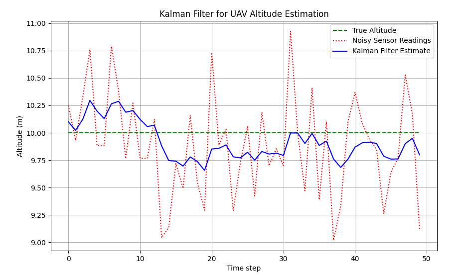

# Understanding-Kalman-Filter
Easy approach to understand Kalman filter. A quick and short crisp information to understand it in a easy way. The examples shows the random values around 10 m we predict fake values which is given by IMU.

# Explanation of Results:

    True Altitude: The UAV is actually at 10 meters.
    Sensor Readings: The sensor gives noisy readings around 10 meters.
    Goal: Use the Kalman filter to estimate the UAV’s true altitude based on the noisy sensor readings.

    True Altitude (Green, dashed): The UAV is maintaining a constant 10-meter altitude.
    Noisy Sensor Readings (Red, dotted): These are noisy measurements around the actual 10-meter altitude.
    Kalman Filter Estimate (Blue): The Kalman filter smooths out the noise and gives a more accurate estimate of the UAV’s true altitude.

This implementation helps keep the altitude estimate accurate despite the noisy sensor readings. The Kalman filter corrects the estimate after each sensor update.

